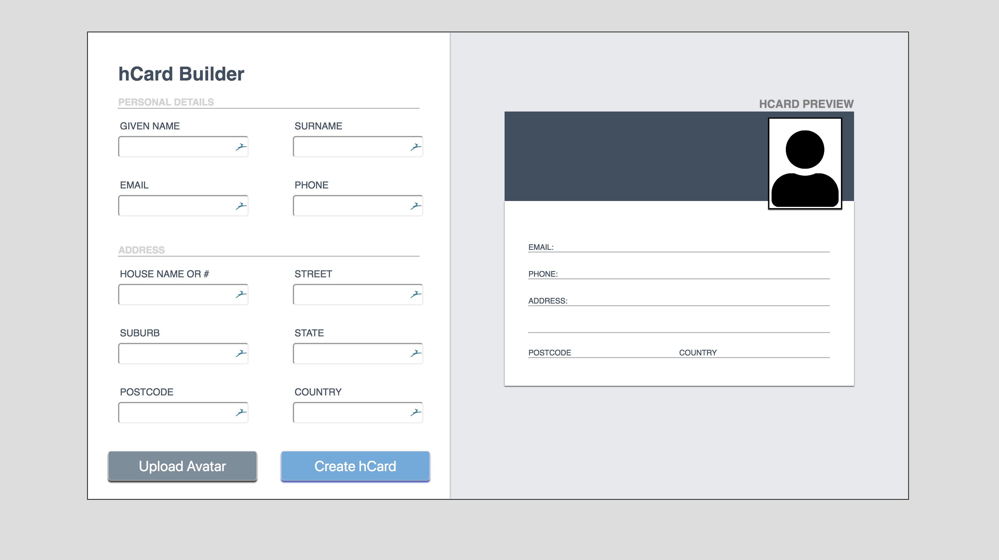

# Coding Challenge

Thankyou for the opportunity to submit this challenge. It was very enjoyable.

## Challenge Scope
To create an interactive hCard Builder app with React. User can input data and get immediate validation and preview.



### Getting Running

View live at

http://vibrant-wiles-ce259c.netlify.com

Or run locally

Inside the root directory

```npm install```

```npm start```

this will serve the app on localhost:3000

## Features of submission
* Mobile Responsive
* Form validation on all inputs
* Dynamic update of the preview
* Ability to upload Avatar by clicking button or the avatar icon
* Dynamic update of upload avatar button
* Immediate feedback of file types and size accepted for the avatar
* Unit tests with Jest and Enzyme


## Coding Decisions
* Use React framework to allow instant feedback to user
* Use CSS flexbox for responsive design
* No use of CSS framework eg: Bootstrap

## Challenges
* I had never seen the vCard format before so I had to do some learning to understand the requirements.
* Creating a reponsive app without using a CSS framework such as Bootstrap
* I dont have a version of photoshop so I would like to get the CSS to match exactly. It was a bit hard to get exact details i used my judgement to get it as close as possible without the exact specifications.
* Using a really bad internet connection to try to setup a virtual machine to run IE10 (I ran out of free trial on browserling )

## Further Improvements
* Get exact details of styling requirements from the designer
* Get on the NBN so i can download a virtual machine :)